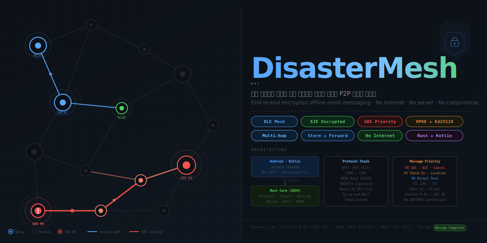

<div align="center">



# DisasterMesh

**종단간 암호화 · 오프라인 우선 · BLE 전용 · 서버 없음 · 인터넷 불필요**

*End-to-end encrypted offline mesh messaging when infrastructure fails*

[](LICENSE)
[](https://developer.android.com)
[](https://kotlinlang.org)
[](https://rust-lang.org)
[](docs/06-security-and-threat-model.md)
[](docs/03-protocol-dme-v1.md)
[](docs/04-protocol-ble-cla-v1.md)
[](docs/16-design-review-v2.0.0-rc1.md)

[**Landing Page**](https://jeiel85.github.io/disaster-mesh)&nbsp;·&nbsp;[**Specification**](docs/)&nbsp;·&nbsp;[**Architecture**](docs/01-system-architecture.md)&nbsp;·&nbsp;[**Security Model**](docs/06-security-and-threat-model.md)&nbsp;·&nbsp;[**Known Limitations**](docs/14-known-limitations.md)

</div>

---

DisasterMesh is an **Android-first, serverless, offline-first** emergency communication system that works when cellular networks, internet, and infrastructure fail. Using Bluetooth Low Energy (BLE), devices form a self-organizing peer-to-peer mesh network that stores, carries, and relays end-to-end encrypted messages across multiple hops — with no server, no internet, and no plaintext visible to relays.

The current design baseline is **v2.0.0-rc1**. It closes the protocol, storage,
transport, and operational contracts needed to begin a commercial-grade
implementation. Goal 0 bootstrap may start; protocol feature work must first pass
the Goal 0.5 normative contract freeze.

> **재난 상황에서** 기지국·인터넷·공유기 없이, 주변 스마트폰과 고정 릴레이만으로  
> 종단간 암호화된 재난 메시지를 **저장·운반·전달**하는 Android 우선 오픈소스 시스템.  
> Bluetooth 전용 · 서버 없음 · 중계 노드가 내용을 읽을 수 없음.

---

## Why This Exists

When earthquakes, floods, hurricanes, or power failures strike, cellular networks become congested or go offline entirely — right when people need to communicate about safety, location, and rescue needs. Standard messaging apps stop working. **DisasterMesh continues working:**

| Problem | DisasterMesh |
|---|---|
| Cellular tower is down | BLE radio in your pocket still works |
| No internet connection | No internet permission declared in release APK |
| Server is unreachable | No server — pure peer-to-peer mesh |
| Messages may be intercepted | HPKE + Ed25519 end-to-end encryption |
| Relay may peek at content | Relay nodes only forward ciphertext they cannot decrypt |
| Process killed mid-transfer | SQLite store-and-forward survives restarts |
| SOS drowned in regular traffic | P0 priority + 12 copy tokens for emergency messages |

---

## Features

| Feature | Detail |
|---|---|
| **BLE Mesh Transport** | Android BLE Central + Peripheral (GATT Server), Noise_XX handshake per link |
| **End-to-End Encryption** | RFC 9180 HPKE Base: X25519 / HKDF-SHA256 / ChaCha20Poly1305 |
| **Sender Authentication** | Ed25519 signatures embedded inside ciphertext |
| **Multi-hop Routing** | Binary Spray-and-Wait with persistent token grant escrow |
| **SOS Priority (P0)** | Highest priority queue, 12 copy tokens, 16 hop limit, 24h TTL |
| **Store and Forward** | SQLite persistence survives process kills; delivers when peers meet later |
| **Privacy by Default** | No INTERNET permission in release; relay nodes see only ciphertext |
| **Contact Verification** | QR code in-person exchange with Ed25519 public keys |
| **Delivery Receipts** | Signed receipts route back to sender through the mesh |
| **No Dependencies** | Pure BLE; no TCP, no UDP, no Wi-Fi, no cloud |

---

## Architecture

```
┌──────────────────── Android App (Kotlin) ───────────────────────┐
│                                                                   │
│  ┌─────────────────────────────────────────────────────────────┐ │
│  │           Jetpack Compose UI Screens                        │ │
│  │  SendMessage · CheckIn · SOS · ContactBook · RelayStatus    │ │
│  └─────────────────────────┬───────────────────────────────────┘ │
│                             │                                     │
│  ┌──────────────┐  ┌────────▼──────────┐  ┌────────────────────┐ │
│  │  Foreground  │  │   MeshCoordinator │  │   BlePlatformAdap  │ │
│  │   Service    │  │   (Kotlin bridge) │  │   Central/Periph   │ │
│  └──────────────┘  └────────┬──────────┘  └────────────────────┘ │
│                             │  UniFFI FFI                         │
├─────────────────────────────┼───────────────────────────────────-┤
│                    ┌────────▼──────────┐                          │
│                    │    MeshEngine     │  (Rust 2024)             │
│  ┌─────────────────┴─────────────────────────────────────────┐   │
│  │  mesh-types  │  mesh-codec  │  mesh-crypto  │  mesh-bundle │   │
│  │  mesh-routing│  mesh-store  │  mesh-engine  │  mesh-sim    │   │
│  │                          mesh-ffi                          │   │
│  └────────────────────────────────────────────────────────────┘   │
│                                                                   │
└────────────────┬──────────────────────────────┬──────────────────┘
                 │                              │
          ┌──────▼───────┐             ┌────────▼────────┐
          │    SQLite    │             │  Android        │
          │  (Rust owns) │             │  Keystore       │
          └──────────────┘             └─────────────────┘
```

**Key principle:** Rust owns everything below the FFI boundary — protocol encoding, cryptography, routing decisions, and the database. Kotlin handles only platform surfaces: BLE radio, UI, and key-wrapping via Android Keystore.

---

## Tech Stack

| Layer | Technology | Rationale |
|---|---|---|
| **UI** | Kotlin + Jetpack Compose | Modern Android-native declarative UI |
| **Core** | Rust 2024 Edition | Memory safety, deterministic codec, no GC pauses |
| **FFI** | UniFFI (single facade crate) | Type-safe Rust ↔ Kotlin binding |
| **Transport** | Android BLE GATT Central + Peripheral | Sole transport; zero internet permission in release |
| **Link Security** | Noise_XX_25519_ChaChaPoly_BLAKE2s | Mutual auth + forward secrecy per BLE session |
| **Message Encryption** | RFC 9180 HPKE Base: X25519/HKDF-SHA256/ChaCha20Poly1305 | Asymmetric E2EE; relay sees only ciphertext |
| **Authentication** | Ed25519 signatures | Compact, fast, embedded in ciphertext |
| **Bundle Protocol** | BPv7 (RFC 9171) — DM-BP7-1 profile | DTN standard; store-and-forward semantics |
| **Serialization** | Deterministic CBOR (RFC 8949) | Compact binary; canonical form for signature coverage |
| **Schema** | CDDL | Machine-verifiable protocol schema |
| **Routing** | Binary Spray-and-Wait + Direct Delivery | Proven DTN algorithm with copy-token escrow |
| **Storage** | SQLite — Rust-owned | Persistent across restarts; encrypted master key |
| **Key Storage** | Android Keystore AES-256 | DB master key never leaves secure enclave |

---

## Message Types

| Type | Priority | TTL | Copy Tokens | Max Payload |
|---|---|---|---|---|
| `PRIVATE_SOS` | **P0** | 24 h | 12 | 7,800 bytes |
| `DELIVERY_RECEIPT` | **P0** | 7 d | — | — |
| `CANCEL` | **P0** | 7 d | — | — |
| `CHECK_IN` | P1 | 48 h | 8 | 7,800 bytes |
| `LOCATION_UPDATE` | P1 | 24 h | 6 | — |
| `DIRECT_TEXT` | P2 | 72 h | 6 | 7,800 bytes |

> P0 messages are always scheduled before P1, P1 before P2. The relay queue enforces this at every BLE transfer opportunity.

---

## Project Structure

```
disaster-mesh/
│
├── core/                          # Rust 2024 workspace (9 crates, one FFI facade)
├── apps/android/                  # Android 15-module project and Gradle wrapper
├── Cargo.toml                     # Locked workspace dependency graph
├── Cargo.lock
├── rust-toolchain.toml            # Rust 1.96.0 + Android targets
│
├── docs/                          # 23 numbered specifications + readiness docs
│   ├── adr/                       # ADR-001 through ADR-016
│   ├── 00-product-requirements.md
│   ├── 01-system-architecture.md
│   ├── ...
│   ├── 16-design-review-v2.0.0-rc1.md
│   ├── 17-commercial-readiness.md
│   ├── 18-privacy-and-data-governance.md
│   ├── 19-operational-readiness.md
│   ├── 20-security-verification-plan.md
│   ├── 21-requirements-traceability.md
│   ├── 22-go-live-checklist.md
│   ├── dependency-review.md
│   └── index.html                 # Landing page (GitHub Pages)
│
├── spec/                          # Exact DME/BLE wire and CDDL contracts
│   ├── dme-v1.cddl
│   ├── dme-aad-v1.cddl
│   ├── ble-control-v1.cddl
│   ├── ble-wire-v1.md
│   ├── contact-card-v1.cddl
│   └── disaster-routing-block-v1.cddl
│
├── schemas/
│   ├── sqlite_v1.sql              # Initial SQLite schema (20 tables)
│   └── schema_invariants.sql      # Queries that must return zero rows
│
├── contracts/                     # Machine-readable constants and FFI sketches
│   ├── protocol_constants.toml
│   ├── state_codes.toml
│   ├── rust_facade.rs
│   └── android_interfaces.kt
│
├── prompts/                       # Goal 0, 0.5, 1–7 implementation prompts
├── test-vectors/                  # Required cases and manifest schemas
├── policies/                      # Privacy and store-disclosure release inputs
├── release/                       # Signed release-evidence manifest schema
├── tools/validate_design_bundle.py
├── SECURITY.md
├── SUPPORT.md
├── IMPLEMENTATION_CHECKLIST.md
├── CHANGELOG.md
├── LICENSE                        # Apache 2.0
└── README.md
```

---

## Documentation

| # | Document | Description |
|---|---|---|
| 00 | [Product Requirements](docs/00-product-requirements.md) | 18 FR + 12 NFR with acceptance criteria |
| 01 | [System Architecture](docs/01-system-architecture.md) | Module boundaries, Rust/Android separation |
| 02 | [Domain Model](docs/02-domain-model.md) | IDs, entities, aggregates, invariants |
| 03 | [Protocol: DME v1](docs/03-protocol-dme-v1.md) | BPv7 profile, DME envelope, HPKE, Ed25519 |
| 04 | [Protocol: BLE CLA v1](docs/04-protocol-ble-cla-v1.md) | GATT UUIDs, frames, Noise handshake |
| 05 | [Routing & Queue](docs/05-routing-and-queue.md) | Spray-and-Wait, token escrow, TTL/hop rules |
| 06 | [Security & Threat Model](docs/06-security-and-threat-model.md) | Threats, mitigations, key management, release gates |
| 07 | [Storage Schema](docs/07-storage-schema.md) | 20-table SQLite schema, transactions, encryption |
| 08 | [Rust Core Contract](docs/08-rust-core-contract.md) | FFI API signatures, engine commands, event model |
| 09 | [Android Implementation](docs/09-android-implementation.md) | Manifest, BLE permissions, module structure |
| 10 | [State Machines](docs/10-state-machines.md) | Service, link, transfer, message lifecycle FSMs |
| 11 | [Testing & Acceptance](docs/11-testing-and-acceptance.md) | Unit, integration, real-device, security test matrix |
| 12 | [Release & Operations](docs/12-release-and-operations.md) | CI gates, field relay setup, incident response |
| 13 | [Development Goals](docs/13-development-goals.md) | Contract freeze, Android implementation, commercial release, post-1.0 expansion |
| 14 | [Known Limitations](docs/14-known-limitations.md) | 13 public limitations and forbidden marketing claims |
| 15 | [References](docs/15-references.md) | Verified primary sources for all standards cited |
| 16 | [Design Review v2.0.0-rc1](docs/16-design-review-v2.0.0-rc1.md) | Resolved commercial implementation blockers and remaining gates |
| 17 | [Commercial Readiness](docs/17-commercial-readiness.md) | Product, release, support, and evidence boundaries |
| 18 | [Privacy & Data Governance](docs/18-privacy-and-data-governance.md) | Data inventory, retention, deletion, and disclosure rules |
| 19 | [Operational Readiness](docs/19-operational-readiness.md) | Recovery, monitoring, rollout, and incident operations |
| 20 | [Security Verification Plan](docs/20-security-verification-plan.md) | MASVS mapping, review scope, and exit evidence |
| 21 | [Requirements Traceability](docs/21-requirements-traceability.md) | Requirement-to-contract-to-test mapping |
| 22 | [Go-Live Checklist](docs/22-go-live-checklist.md) | Required owners, evidence, and release signatures |
| — | [Dependency Review](docs/dependency-review.md) | Lockfile/SBOM-based dependency approval register |

---

## Implementation Roadmap

| Goal | Focus | Key Completion Test |
|---|---|---|
| **Goal 0** | Rust workspace · Android modules · CI · no logic | `cargo test` passes; instrumentation test invokes Rust facade |
| **Goal 0.5** | Freeze wire, state, schema, and command contracts | Validator passes; Goal 1–4 have zero P0 open decisions |
| **Goal 1** | Types · CBOR codec · routing · 100-node simulator | A→B→C simulated delivery; token conservation verified |
| **Goal 2** | Identity · HPKE · Ed25519 · QR contact · test vectors | Golden cryptographic test vectors pass |
| **Goal 3** | Direct BLE transfer · GATT · Noise handshake | Two physical Android devices exchange E2EE message |
| **Goal 4** | Multi-hop relay · token escrow · ACK recovery · receipts | 50× A→B→C cycles; B cannot decrypt payload |
| **Goal 5** | Check-in/SOS UX · battery · foreground service · relay mode | 8h battery report; process kill recovery; thermal test |
| **Goal 6** | Fuzz targets · SBOM · external review · public beta | Release thresholds and dependency/security gates pass |
| **Goal 7** | Commercial release readiness | Go-live checklist complete; rollout and rollback rehearsed |
| **Goal 8** | iOS and fixed relay expansion after Android 1.0 | Shared-core compatibility and field tooling validated |

**Current status:** Goal 0 repository bootstrap completed on **2026-06-29**.
Goal 0.5 normative contract freeze is next; Goal 1–4 feature work remains blocked
until Goal 0.5 acceptance evidence exists.

---

## Architectural Decisions

Sixteen locked ADRs define the constraints that everything else is built around:

| ADR | Decision | Rationale |
|---|---|---|
| [ADR-001](docs/adr/ADR-001-android-first.md) | Android first; iOS/Linux relay in v1.1 | Maximize initial reach on single platform |
| [ADR-002](docs/adr/ADR-002-rust-owns-protocol-db.md) | Rust core owns protocol, crypto, and SQLite | Single source of truth; no Kotlin/Rust drift |
| [ADR-003](docs/adr/ADR-003-bpv7-profile.md) | BPv7 constrained profile; private block type 192 | DTN standard; interoperability foundation |
| [ADR-004](docs/adr/ADR-004-message-security.md) | HPKE Base + Ed25519; no Double Ratchet in v1 | Simplicity + external audit feasibility |
| [ADR-005](docs/adr/ADR-005-ble-gatt.md) | BLE GATT exclusively; no TCP/UDP fallback | Zero INTERNET permission; minimal attack surface |
| [ADR-006](docs/adr/ADR-006-spray-and-wait.md) | Binary Spray-and-Wait with copy tokens | Proven DTN algorithm; bounded resource use |
| [ADR-007](docs/adr/ADR-007-token-grant-escrow.md) | Persistent token grant escrow | Prevents token inflation after ACK loss |
| [ADR-008](docs/adr/ADR-008-endpoint-only-control.md) | Only sender can revoke; relays ignore cancel targets | Prevents relay-level censorship of messages |
| [ADR-009](docs/adr/ADR-009-authenticated-hop-limit.md) | Authenticate immutable hop limit in DME AAD | Prevents relay-side route-budget escalation |
| [ADR-010](docs/adr/ADR-010-control-message-terminal-rules.md) | Receipt and cancel terminal rules | Prevents recursive control traffic |
| [ADR-011](docs/adr/ADR-011-persisted-replay-bitmap.md) | Persist a 4096-bit replay bitmap | Survives reordering and process restarts |
| [ADR-012](docs/adr/ADR-012-exact-ble-wire-format.md) | Fix the BLE byte-level wire contract | Makes independent implementations interoperable |
| [ADR-013](docs/adr/ADR-013-platform-command-correlation.md) | Correlate async platform commands by ID | Prevents cross-link callback confusion |
| [ADR-014](docs/adr/ADR-014-local-encryption-envelope.md) | Version and bind local encrypted columns | Defines recovery and corruption behavior |
| [ADR-015](docs/adr/ADR-015-commercial-release-governance.md) | Require signed commercial release evidence | Makes launch approval auditable |
| [ADR-016](docs/adr/ADR-016-no-delivery-guarantee.md) | Forbid delivery-guarantee claims | Keeps safety messaging truthful |

---

## Security Notes

> **This app is a delivery probability aid, not a guaranteed emergency communication system.**

- Messages may not arrive if no relay path exists or all devices are off
- Forward secrecy is **not** provided in v1.0 (HPKE single-shot; not ratcheting)
- Metadata is not anonymous — message size, priority, and timestamps are visible to relays
- GPS requires clear sky and a recent fix; indoors it may be unavailable
- Cancellation does not guarantee removal from already-relayed copies

The v2.0.0-rc1 design closes the known implementation-contract blockers, but it is
not production certification. **External cryptographic/protocol review, Android
device and soak evidence, privacy/legal review, field exercises, and every required
go-live signature remain mandatory before stable release.** See
[`docs/20-security-verification-plan.md`](docs/20-security-verification-plan.md) and
[`docs/22-go-live-checklist.md`](docs/22-go-live-checklist.md).

**Forbidden marketing claims:** "guaranteed delivery", "real-time without networks", "completely anonymous", "unhackable", "official emergency response", "equal to Signal", "zero battery impact".

---

## Normative Source Order

When files disagree, implementation follows this order:

1. `spec/` wire and CDDL contracts
2. `contracts/state_codes.toml` and `contracts/protocol_constants.toml`
3. `schemas/sqlite_v1.sql`
4. Numbered `docs/` and `docs/dependency-review.md`
5. `SECURITY.md`, `SUPPORT.md`, `policies/`, and `release/`
6. `prompts/` and historical material in `archive/`

Protocol, database, or persisted-state changes must update the ADR, machine-readable
contract, and test-vector requirements together in one pull request.

---

## Contributing

This project is in the design phase. All protocol changes require:

- Updated CDDL schema in `spec/`
- Updated machine-readable state/constants and SQLite invariants where applicable
- Updated test vectors in `test-vectors/`
- ADR amendment or new ADR if the decision is architectural
- Updated `IMPLEMENTATION_CHECKLIST.md` completion gates

See [`docs/13-development-goals.md`](docs/13-development-goals.md) for the full implementation guide.

1. Fork the repository
2. Review the [specification](docs/) and [implementation checklist](IMPLEMENTATION_CHECKLIST.md)
3. Pick a goal from [`docs/13-development-goals.md`](docs/13-development-goals.md)
4. Open a pull request referencing the relevant requirement IDs

---

## License

Copyright 2026 The DisasterMesh Authors

Licensed under the [Apache License 2.0](LICENSE).

> Protocol and security properties may change before stable v1.0. See [`docs/14-known-limitations.md`](docs/14-known-limitations.md) for the complete list of limitations and [`docs/06-security-and-threat-model.md`](docs/06-security-and-threat-model.md) for the full release gate requirements.

---

<div align="center">
<sub>
BLE Service UUID: <code>6f1d0001-8f6b-4d5b-9c61-57c43d4d4d31</code> &nbsp;·&nbsp;
Android API 26+ &nbsp;·&nbsp; Rust 2024 Edition &nbsp;·&nbsp; Apache 2.0
</sub>
</div>
